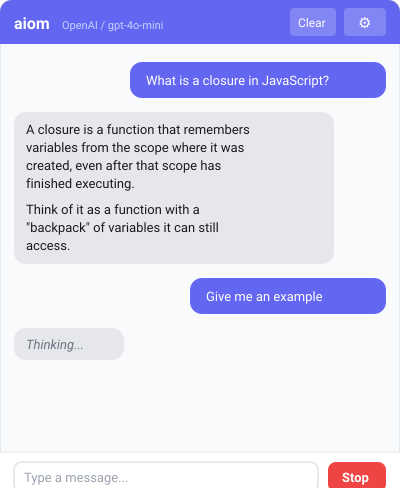
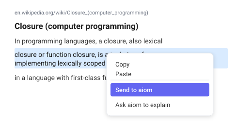
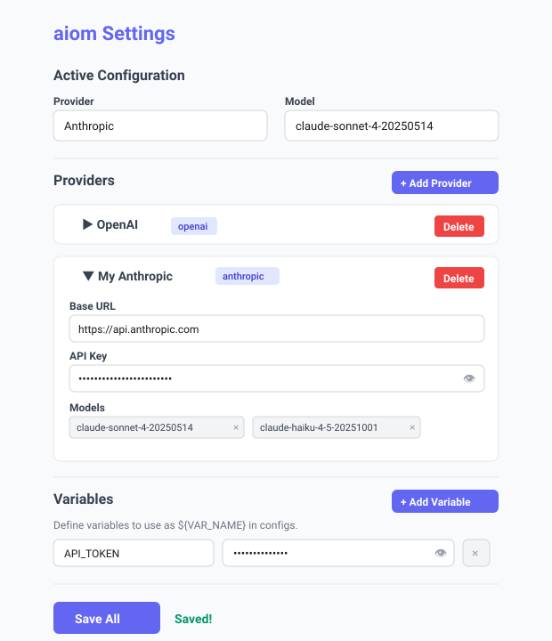

# aiom — AI on Message

A Chrome extension that lets you chat with AI providers (OpenAI, Anthropic, or any compatible API) directly from your browser. Select text on any page and send it to AI with a right-click.

## Screenshots

<p align="center">
  
  &nbsp;&nbsp;&nbsp;
  
</p>

<p align="center">
  
</p>

## Features

- **Chat popup** — click the extension icon to open a chat window. Conversation history persists between sessions.
- **Multiple AI providers** — configure OpenAI, Anthropic, or any OpenAI-compatible API (e.g. Together, Groq, Eliza proxy).
- **Context menu actions** — select text on any page, right-click:
  - **Send to aiom** — sends the selected text as-is to the chat
  - **Ask aiom to explain** — asks AI to explain the selected term
- **Stop generation** — cancel an in-progress response at any time.
- **Variables** — define `${VAR_NAME}` placeholders for API keys and URLs, so you can share configs without exposing secrets.
- **JSON import** — bulk-import providers from an opencode-style config or custom JSON.

## Installation

### From source

```bash
git clone https://github.com/kotsmile/aiom.git
cd aiom
npm install
npm run build
```

Then load in Chrome:

1. Open `chrome://extensions`
2. Enable **Developer mode** (top right)
3. Click **Load unpacked** → select the `dist/` folder
4. Pin the extension from the puzzle icon in the toolbar

### Development

```bash
npm run dev
```

This runs `vite build --watch` — rebuilds on every file save. After each rebuild, go to `chrome://extensions` and click the reload button on the aiom card.

## Setup

1. Click the extension icon → click **⚙** (settings)
2. Add a provider or use the defaults (OpenAI / Anthropic)
3. Enter your API key and select a model
4. Click **Save All**
5. Start chatting!

### Adding a custom provider

Click **+ Add Provider** in settings and fill in:

| Field | Description |
|-------|-------------|
| **Name** | Display name (e.g. "My Groq") |
| **Type** | API format — `OpenAI-compatible` or `Anthropic` |
| **Base URL** | API endpoint (e.g. `https://api.groq.com/openai/v1`) |
| **API Key** | Your API key, or leave empty if using custom headers |
| **Custom Headers** | Additional HTTP headers (e.g. `Authorization: OAuth token`) |
| **Models** | List of model IDs available on this provider |

### Using variables

If you don't want to paste raw API keys into provider configs:

1. Go to **Variables** section in settings
2. Add a variable: `SOY_TOKEN` = `your-secret-key`
3. In the provider's API Key field, use `${SOY_TOKEN}`

The placeholder is resolved at request time — only the variable value is sent to the API.

### Importing from JSON

Paste a config into the **Import JSON Config** textarea. Two formats are supported:

**opencode format:**
```json
{
  "provider": {
    "my-provider": {
      "name": "My Provider",
      "npm": "@ai-sdk/openai-compatible",
      "options": {
        "baseURL": "https://api.example.com/v1",
        "apiKey": "sk-..."
      },
      "models": {
        "model-a": { "name": "Model A" },
        "model-b": { "name": "Model B" }
      }
    }
  }
}
```

**Custom format:**
```json
{
  "providers": {
    "my-provider": {
      "name": "My Provider",
      "type": "openai",
      "baseUrl": "https://api.example.com/v1",
      "apiKey": "sk-...",
      "models": ["model-a", "model-b"]
    }
  }
}
```

## Tech stack

- React 19 + TypeScript
- Tailwind CSS v4
- Vite (multi-page build)
- Chrome Manifest V3

## Project structure

```
aiom/
├── public/
│   ├── background.js        # Service worker (context menus)
│   ├── manifest.json
│   └── icons/
├── src/
│   ├── types.ts              # Shared TypeScript types
│   ├── lib/
│   │   ├── storage.ts        # chrome.storage wrappers
│   │   └── providers.ts      # OpenAI & Anthropic API calls
│   ├── components/
│   │   └── PasswordInput.tsx  # Reusable password toggle input
│   ├── popup/
│   │   ├── Popup.tsx          # Chat UI
│   │   └── main.tsx
│   └── settings/
│       ├── Settings.tsx       # Main settings page
│       ├── ProviderCard.tsx   # Provider editor card
│       ├── VariablesSection.tsx
│       ├── ImportSection.tsx
│       └── main.tsx
├── vite.config.ts
├── tsconfig.json
└── package.json
```

## License

ISC
